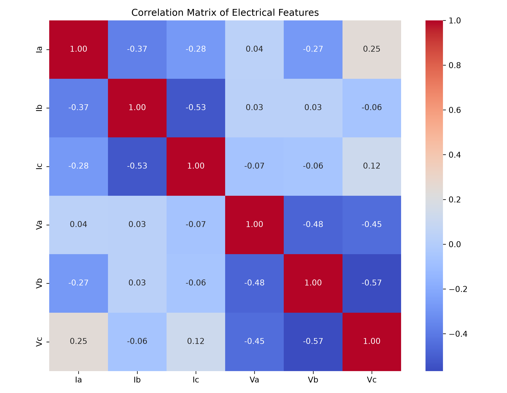
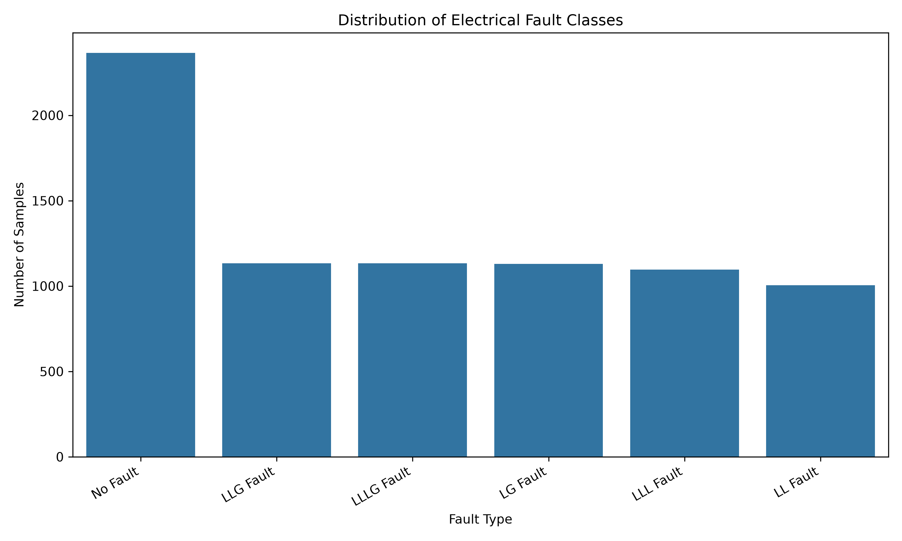
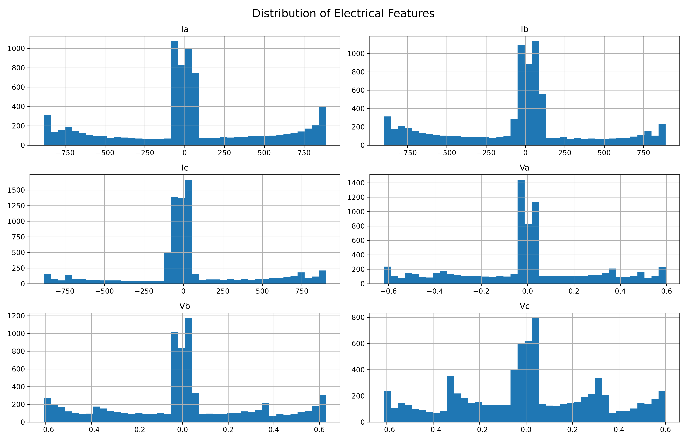
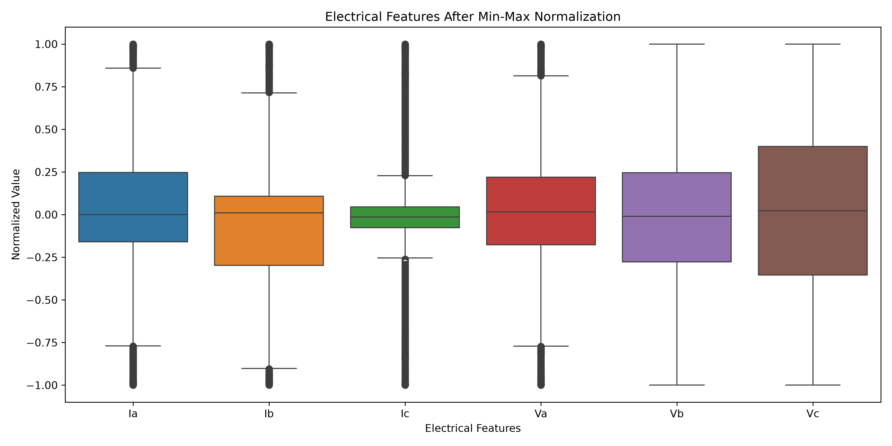

# ⚡ 3-Phase Electrical Transmission Fault Diagnostics & ML Preprocessing Pipeline

[](https://www.python.org/)
[](https://scikit-learn.org/)
[](https://pandas.pydata.org/)
[](https://numpy.org/)
[](https://opensource.org/licenses/MIT)

An end-to-end Machine Learning data preprocessing, exploratory data analysis (EDA), and feature engineering pipeline designed for **3-Phase Electrical Power Transmission Systems**. This project cleans, analyzes, and normalizes multi-sensor electrical current and voltage signals to prepare high-quality data for multi-class and multi-output electrical fault classification models.

---

## 📌 Table of Contents
- [Project Overview](#-project-overview)
- [Key Features](#-key-features)
- [Dataset Architecture](#-dataset-architecture)
- [Fault Class Mapping](#-fault-class-mapping)
- [Data Preprocessing Pipeline](#-data-preprocessing-pipeline)
  - [1. Data Integrity & Missing Values](#1-data-integrity--missing-value-analysis)
  - [2. Domain-Aware Outlier Retention](#2-domain-aware-outlier-retention-strategy)
  - [3. Stratified Partitioning](#3-stratified-train-test-partitioning)
  - [4. Leak-Free Min-Max Normalization](#4-leak-free-min-max-normalization)
- [Visualizations & EDA](#-visualizations--eda)
- [Project Structure](#-project-structure)
- [Getting Started](#-getting-started)
- [Outputs & Generated Artifacts](#-outputs--generated-artifacts)
- [Tech Stack](#-tech-stack)

---

## 🔍 Project Overview

Electrical transmission systems are susceptible to sudden short-circuit faults (e.g., line-to-ground, phase-to-phase) caused by lightning strikes, equipment insulation breakdown, and environmental hazards. Swift detection and classification are vital for power grid reliability.

This repository provides an automated, leak-free preprocessing pipeline that ingests raw 3-phase instantaneous electrical measurements ($I_a, I_b, I_c, V_a, V_b, V_c$) and generates standardized training and testing datasets ready for machine learning model training.

---

## ✨ Key Features

- **Multi-Class Fault Transformation**: Converts multi-target binary indicators ($G, C, B, A$) into structured multi-class fault categories (`LG`, `LL`, `LLG`, `LLL`, `LLLG`, `No Fault`).
- **Domain-Specific Outlier Preservation**: Uses IQR analysis while retaining physical current surges and voltage dip anomalies critical for electrical fault detection.
- **Stratified Partitioning (75/25)**: Ensures exact fault category representation across train and test partitions to avoid imbalanced evaluation.
- **Leak-Free Normalization**: Min-Max scaling in the range $[-1, 1]$ (fitted solely on the training partition) preserving sinusoidal AC phase polarity.
- **Automated Diagnostic Reporting**: Generates statistical summaries, correlation heatmaps, class distribution logs, and pre/post scaling boxplots.

---

## 📊 Dataset Architecture

The pipeline processes continuous 3-phase electrical signals and multi-target fault flags:

### 1. Input Features (Continuous Sensor Signals)
| Feature | Physical Meaning | Description |
| :--- | :--- | :--- |
| `Ia` | Phase A Current | Instantaneous line current in Phase A (Amperes) |
| `Ib` | Phase B Current | Instantaneous line current in Phase B (Amperes) |
| `Ic` | Phase C Current | Instantaneous line current in Phase C (Amperes) |
| `Va` | Phase A Voltage | Instantaneous line-to-neutral voltage in Phase A (Volts / p.u.) |
| `Vb` | Phase B Voltage | Instantaneous line-to-neutral voltage in Phase B (Volts / p.u.) |
| `Vc` | Phase C Voltage | Instantaneous line-to-neutral voltage in Phase C (Volts / p.u.) |

### 2. Multi-Target Indicators (Binary Output Flags)
- `G`: Ground indicator ($1 = \text{Ground fault present}$, $0 = \text{No ground involvement}$)
- `C`: Phase C indicator ($1 = \text{Phase C faulted}$, $0 = \text{Normal}$)
- `B`: Phase B indicator ($1 = \text{Phase B faulted}$, $0 = \text{Normal}$)
- `A`: Phase A indicator ($1 = \text{Phase A faulted}$, $0 = \text{Normal}$)

---

## 🏷️ Fault Class Mapping

The binary target indicators `[G, C, B, A]` are mapped into standardized industry fault classifications:

| Binary Code (`GCBA`) | Fault Category | Description | Dataset Samples |
| :---: | :--- | :--- | :---: |
| `0000` | **No Fault** | Normal balanced power system operation | 2,365 |
| `1001` | **LG Fault** | Single Line-to-Ground (Phase A to Ground) | 1,129 |
| `0110` | **LL Fault** | Line-to-Line Fault (Phase B to Phase C) | 1,004 |
| `1011` | **LLG Fault** | Double Line-to-Ground Fault (Phase A & B to Ground) | 1,134 |
| `0111` | **LLL Fault** | Symmetrical Three-Phase Fault (Phase A, B, C) | 1,096 |
| `1111` | **LLLG Fault** | Symmetrical Three-Phase-to-Ground Fault | 1,133 |

---

## ⚙️ Data Preprocessing Pipeline

```
  Raw Sensor Data (classData.csv)
                │
                ▼
   1. Data Integrity & Null Verification
                │
                ▼
   2. IQR Outlier Profiling (Domain-Aware Retention)
                │
                ▼
   3. Multi-Class Fault Code Engineering
                │
                ▼
   4. Stratified Train/Test Split (75% Train / 25% Test)
                │
                ▼
   5. Min-Max Normalization (Range [-1, 1], Fitted on Train Only)
                │
                ▼
   Standardized Datasets & Diagnostic Outputs
```

### 1. Data Integrity & Missing Value Analysis
- Dataset shape verification, attribute type assertions, and missing value checks confirmed zero missing or corrupted values.
- Duplicate record validation guarantees training data uniqueness.

### 2. Domain-Aware Outlier Retention Strategy
- Outliers identified via Interquartile Range (IQR):
  $$\text{IQR} = Q_3 - Q_1, \quad [\text{Lower} = Q_1 - 1.5 \times \text{IQR}, \; \text{Upper} = Q_3 + 1.5 \times \text{IQR}]$$
- **Domain Rationale**: High-amplitude current surges ($>800\text{ A}$) and steep voltage drops represent genuine physical transient fault signatures. Removing these entries would strip the dataset of true fault signals. Hence, all outliers are deliberately preserved.

### 3. Stratified Train-Test Partitioning
- Partitioned dataset into **75% Training (5,895 samples)** and **25% Testing (1,966 samples)**.
- Stratification applied across `Fault_Code` to maintain uniform representation of balanced and unbalanced fault events across splits.

### 4. Leak-Free Min-Max Normalization
- Scaled all continuous electrical features ($I_a, I_b, I_c, V_a, V_b, V_c$) to the range **$[-1, +1]$** using `MinMaxScaler`.
- **Zero Data Leakage Protocol**: The scaler is fitted solely on the training partition and transformed across test sets.
- The $[-1, 1]$ boundary accommodates both positive and negative half-cycles of alternating current (AC) sinusoidal signals.

---

## 📈 Visualizations & EDA

### 1. Electrical Feature Correlation Matrix
Inter-phase relationship analysis across voltage and current channels:
<p align="center">
  
</p>

### 2. Fault Class Distribution
Balanced distribution across all 5 fault categories and healthy operating conditions:
<p align="center">
  
</p>

### 3. Feature Distributions & Boxplots (Before vs. After Normalization)
<p align="center">
  
  
</p>

---

## 📂 Project Structure

```
3phase-fault-ml-preprocessing/
│
├── data/
│   ├── classData.csv                 # Raw 3-phase electrical fault dataset
│   └── detect_dataset.csv            # Detection validation dataset
│
├── outputs/
│   ├── 01_missing_values.png         # Missing value verification plot
│   ├── 02_boxplot_before.png         # Raw sensor distributions
│   ├── 03_feature_distributions.png  # Feature histogram profiles
│   ├── 04_correlation_matrix.png     # Pearson feature correlation heatmap
│   ├── 05_fault_distribution.png     # Multi-class category count plot
│   ├── 06_boxplot_after.png          # Scaled feature boxplots
│   ├── descriptive_statistics.csv    # Descriptive summary statistics
│   ├── fault_distribution.csv        # Class balance metrics
│   ├── missing_values.csv            # Data integrity log
│   ├── normalization_comparison.csv  # Pre/post scaling min-max values
│   ├── outlier_counts.csv            # IQR outlier counts
│   ├── train_preprocessed.csv        # Scaled & stratified training dataset (75%)
│   └── test_preprocessed.csv         # Scaled & stratified testing dataset (25%)
│
├── preprocessing.py                  # Complete end-to-end preprocessing pipeline script
├── requirements.txt                  # Python package dependencies
├── .gitignore                        # Standard Git ignore rules
└── README.md                         # Comprehensive project documentation
```

---

## 🚀 Getting Started

### 1. Clone the Repository
```bash
git clone https://github.com/anjaliverma4/3phase-fault-ml-preprocessing.git
cd 3phase-fault-ml-preprocessing
```

### 2. Set Up a Virtual Environment (Optional but Recommended)
```bash
# On Windows
python -m venv venv
venv\Scripts\activate

# On macOS/Linux
python3 -m venv venv
source venv/bin/activate
```

### 3. Install Dependencies
```bash
pip install -r requirements.txt
```

### 4. Execute Preprocessing Pipeline
```bash
python preprocessing.py
```
*This will perform EDA, display visual diagnostic figures, and save all preprocessed datasets into the `outputs/` folder.*

---

## 📦 Outputs & Generated Artifacts

Executing `preprocessing.py` produces clean, ML-ready CSVs in the `outputs/` directory:
- **`train_preprocessed.csv`**: Scaled features, individual fault target flags, encoded fault codes, and string labels for model training.
- **`test_preprocessed.csv`**: Unbiased test dataset scaled strictly using training parameters for accurate evaluation.

---

## 🛠️ Tech Stack

- **Core Language:** Python 3.8+
- **Data Manipulation:** `pandas`, `numpy`
- **Feature Engineering & Preprocessing:** `scikit-learn` (`MinMaxScaler`, `train_test_split`)
- **Data Visualization:** `matplotlib`, `seaborn`

---

